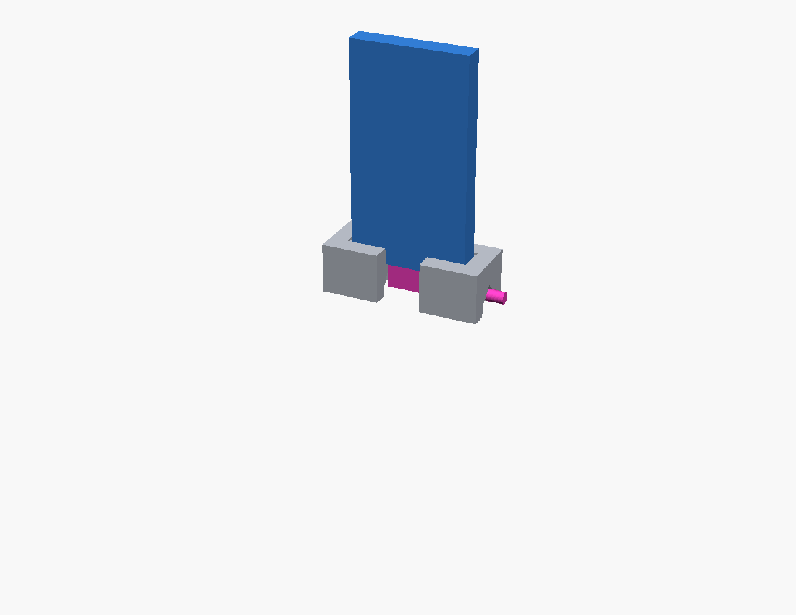

# Parametric USB hub desk stand (right-angle USB-C cable)

A small weighted block that stands a thin, flat USB hub upright on your desk and
keeps the **USB-C socket on its bottom end** plugged in and usable.

It's built for a **right-angle ("dogleg") USB-C cable**: the plug drops into a
cavity beneath the hub, and the cable turns and leaves through **either side
face**, or straight down through the base. A **full-height slot** in the front
lets you reach in and grab the plug to unplug it.

## Why it's parametric

There are dozens of nearly identical "flat stick" USB hubs and they're all a
couple of millimetres different. Rather than model one, every dimension is a
parameter. Fitting your hub means measuring three things.

## Fitting your hub

Open `hub_holder.scad` in [OpenSCAD](https://openscad.org/) and use
**Window → Customizer**, or edit the values at the top of the file.

1. **Measure the hub** (calipers, largest reading — include any moulding seam
   or the lip around the socket):

   | Parameter       | What to measure                          |
   |-----------------|------------------------------------------|
   | `hub_width`     | long side of the rectangular end         |
   | `hub_thickness` | short side of the rectangular end        |
   | `hub_length`    | tip to tip (preview only, not critical)  |

2. **Measure the cable plug** (the right-angle USB-C plug on your cable):

   | Parameter             | What to measure                                    |
   |-----------------------|----------------------------------------------------|
   | `plug_body_width`     | plug body, across the hub's wide axis               |
   | `plug_body_thickness` | plug body, across the hub's thin axis               |
   | `plug_body_height`    | how far the plug + strain relief hangs below the hub|
   | `cable_diameter`      | the bare cable just past the plug                   |

3. Render (F6), export STL (F7), print.

### If the hub doesn't fit after printing

Change **only** `hub_clearance` and reprint:

* won't go in → raise it (try `0.6`, then `0.8`)
* rattles → lower it (try `0.3`, then `0.2`)

FDM printers always shrink slots slightly, so some clearance is normal.

### If a tall hub feels tippy

Increase `block_depth` (front-to-back is the weak direction) and/or
`pocket_depth` for a firmer grip.

### If the plug is hard to unplug

The plug should be gripped only by the hub's own socket, not the holder. Raise
`plug_clearance` (try `2.5`, then `3`). You can also open things up more with
`front_slot_width` (front access slot), `cable_channel_height`, and
`channel_extra_width`. Set `front_slot_width = 0` to close the front.

## Printing

* **Orientation:** as modelled — flat on the bed, slot up.
* **Supports:** **not required, and none wanted.** The block sits flat (no feet,
  no gap underneath), the plug cavity is open top and bottom, the front access
  slot runs straight through from top to bottom (no roof), and the cable channel
  roof is a 45° gable. No horizontal internal face anywhere — leaving supports
  on just makes a mess to clean out.
* **Settings:** PLA or PETG, ~15–20 % infill. The mass is what keeps it upright.
* No glue, no fasteners.

## Files

| File                | Purpose                                             |
|---------------------|-----------------------------------------------------|
| `hub_holder.scad`   | the model — the only file you need                  |
| `preview_scene.scad`| coloured holder + mock hub + mock plug, for renders |
| `shots.sh`          | renders the preview PNGs (Linux, flatpak OpenSCAD)  |
| `render_stl.py`     | no-GPU STL→PNG fallback previewer                   |

## License

CC-BY 4.0. Attribution appreciated, commercial use allowed.
# usb-hub-holder
